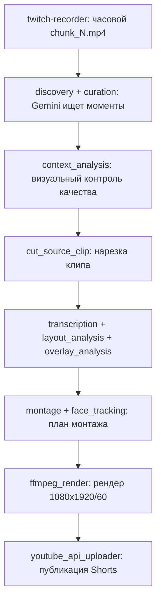

# StreamSlice

StreamSlice превращает часовые записи Twitch-стримов в вертикальные короткие ролики (1080×1920/60 FPS) для TikTok, Reels и YouTube Shorts: Gemini находит вирусные моменты, размечает субтитры и кадрирование, FFmpeg монтирует и рендерит клип с распознаванием лица, а YouTube Data API публикует результат.

## Поток данных



## Две роли

Один и тот же пакет `streamslice` запускается в двух режимах, различающихся только конфигом:

- **хост** (`config/remote.yaml`) — слабый VPS. Принимает часовые чанки от `twitch-recorder`, отбирает моменты через Gemini (CLIProxyAPI), нарезает исходные клипы, складывает задания в очередь рендера (`render.enabled: false`). Не запускает FFmpeg-рендер.
- **локальный ПК** (`config/local-render.yaml`) — забирает задания из очереди, рендерит их через FFmpeg с NVENC, публикует готовые ролики на YouTube.

Обмен заданиями идёт через rclone и каталог очереди на Google Drive (`queue.remote_jobs`/`queue.remote_results`), см. [ARCHITECTURE.md](docs/ARCHITECTURE.md#граница-хост--пк).

Запись стрима — отдельный сервис `twitch-recorder`, не входящий в этот репозиторий. Контракт между ним и StreamSlice описан в [DEPLOYMENT.md](docs/DEPLOYMENT.md#связь-с-twitch-recorder).

## Требования

- Python 3.11+;
- FFmpeg 7.0+ — рендер использует покадровый пересчёт `crop` (`x`/`y` expressions, `eval=frame`), более старые сборки не поддерживают это корректно;
- NVENC-совместимая GPU для рендера на локальном ПК (`h264_nvenc`);
- rclone — обмен между хостом и ПК, синхронизация исходников;
- CLIProxyAPI — локальный прокси, отдающий доступ к Gemini по OAuth (Antigravity).

## Быстрый старт

```bash
git clone <repo> streamslice
cd streamslice
python3 -m venv .venv
.venv/bin/pip install -e '.[audio,dev]'
cp config/default.yaml config/my-local.yaml   # отредактировать пути под себя
export CLIPROXY_API_KEY='ваш-ключ'
```

Проверка окружения (бинарники, прокси, доступные модели):

```bash
PYTHONPATH=src python3 -m streamslice.cli --config config/my-local.yaml doctor
```

Первый прогон на одном файле:

```bash
PYTHONPATH=src python3 -m streamslice.cli --config config/my-local.yaml process --input /path/to/chunk.mp4
```

## Команды CLI

Полный список — `src/streamslice/cli.py`.

| Команда | Флаги | Что делает |
|---|---|---|
| `doctor` | — | Проверяет бинарники (ffmpeg, ffprobe, rclone, node, npm, chromium), доступность CLIProxyAPI и настроенных моделей |
| `process` | `--input` | Обрабатывает один локальный MP4-файл целиком: от отбора моментов до рендера/подготовки задания |
| `sync` | `--confirm-cleanup` | Синхронизирует записи стримов с удалённого хранилища (`sync.remote`) в `sync.local_dir` |
| `run` | `--confirm-cleanup` | `sync` + `process` по всем скачанным файлам |
| `run-latest` | `--streamer`, `--chunks`, `--confirm-cleanup` | Скачивает и обрабатывает только указанные номера чанков самого свежего каталога стримера |
| `render-job` | `--input`, `--parallel` | Рендерит одно подготовленное задание (`render-job.json`) из указанного каталога |
| `render-queue` | — | Синхронизирует очередь заданий с облака, рендерит все pending-задания, выгружает результаты и (опционально) публикует на YouTube |
| `youtube-upload` | `--video`, `--metadata`, `--debug` | Публикует один готовый MP4 на YouTube Shorts по файлу метаданных |
| `youtube-login` | — | Интерактивная OAuth-авторизация всех настроенных Google Cloud проектов |

`--config` (по умолчанию `config/default.yaml`) и `--verbose` доступны для всех команд.

## Документация

- [ARCHITECTURE.md](docs/ARCHITECTURE.md) — стадии конвейера, артефакты, кэширование, контракт `remotion-props.json`
- [CONFIGURATION.md](docs/CONFIGURATION.md) — полный справочник по `config/*.yaml`
- [TEMPLATES.md](docs/TEMPLATES.md) — как устроены и как писать свои шаблоны раскладки кадра
- [MONTAGE.md](docs/MONTAGE.md) — автоматический монтаж (вырезание пауз, punch-in, трекинг лица)
- [DEPLOYMENT.md](docs/DEPLOYMENT.md) — развёртывание хоста и локального ПК, CLIProxyAPI, диагностика

## Связанные проекты

- **twitch-recorder** — отдельный репозиторий, круглосуточно опрашивающий Twitch Helix API и записывающий поток через `streamlink | ffmpeg -f segment` в часовые чанки. По готовности чанка вызывает `tools/process_chunk_for_queue.py` из этого репозитория.

## Лицензия

MIT.
