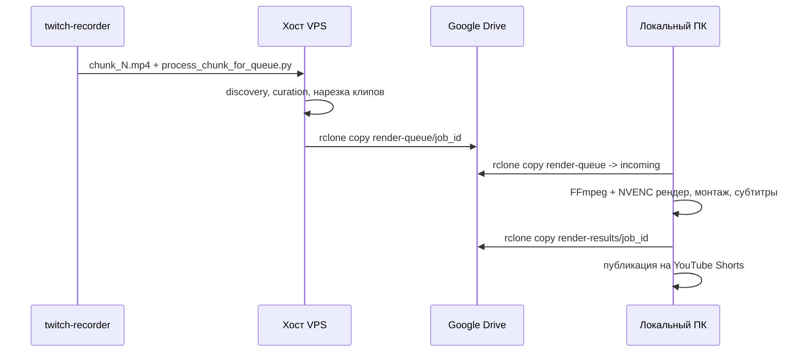

# Развёртывание

Схема — две машины с одним и тем же пакетом `streamslice`, различающиеся только конфигом (см. [ARCHITECTURE.md](ARCHITECTURE.md#граница-хост--пк)):



## Деплой хоста

Хост — слабый VPS без GPU и без Chromium; `render.enabled: false` в `config/remote.yaml`. Единственный путь установки, зафиксированный в репозитории, — `deploy/install_host.sh`.

### Пакеты и каталоги

Скрипт `deploy/install_host.sh` создаёт:

```
/opt/streamslice           # код StreamSlice + venv
/opt/cliproxy               # бинарник и конфиг CLIProxyAPI
/var/lib/streamslice/output
/var/lib/streamslice/work
/var/lib/streamslice/render-queue
/var/log/cliproxy
```

Перед запуском в `/tmp` должны лежать: `streamslice-deploy.tar.gz` (архив репозитория), `cli-proxy-api` (бинарник CLIProxyAPI), `config.yaml` (конфиг CLIProxyAPI с уже настроенным OAuth). Скрипт отказывается работать, если `/opt/streamslice` уже существует — повторный запуск не идемпотентен и требует ручной очистки.

```bash
sudo bash deploy/install_host.sh
```

Что делает скрипт по шагам:

1. Создаёт каталоги (см. выше) с правами `0755`.
2. Распаковывает архив кода в `/opt/streamslice`, ставит бинарник CLIProxyAPI (`0755`) и его конфиг (`0600`).
3. Проверяет, что CLIProxyAPI слушает `127.0.0.1` — иначе выходит с ошибкой (порт **не должен** открываться наружу).
4. Ставит `deploy/cliproxy.service` в `/etc/systemd/system/cliproxy.service`.
5. Создаёт systemd drop-in `twitch-recorder.service.d/streamslice-env.conf`, добавляющий `EnvironmentFile=/etc/streamslice.env` и `ReadWritePaths=/var/lib/streamslice` к юниту recorder'а (нужно, если у recorder'а стоит `ProtectSystem=strict`).
6. Создаёт venv и ставит StreamSlice: `pip install -e /opt/streamslice`.
7. Извлекает API-ключ из `config.yaml` CLIProxyAPI и пишет `/etc/streamslice.env` с правами `0600`.
8. `systemctl daemon-reload`, проверка импорта пакета, вывод `sha256sum` бинарника прокси и `DEPLOY_OK`.

### `/etc/streamslice.env`

Единственная обязательная переменная — `CLIPROXY_API_KEY` (пример в `deploy/streamslice.env.example`). Файл создаётся `install_host.sh` автоматически с правами `0600`; при ручной правке следить, чтобы права не расширялись.

### systemd: CLIProxyAPI

`deploy/cliproxy.service` — юнит с `ProtectSystem=strict`, `ProtectHome=read-only`, доступ на запись только к `/var/log/cliproxy` и `/root/.cli-proxy-api`. Проверка после запуска:

```bash
systemctl status cliproxy
curl -s http://127.0.0.1:8081/v1/models -H "Authorization: Bearer $(grep CLIPROXY_API_KEY /etc/streamslice.env | cut -d= -f2)"
```

### Обновление интеграции с recorder'ом

После первичного применения `deploy/twitch-recorder-processor.patch` к репозиторию recorder'а, повторные обновления retry-логики применяются идемпотентно скриптом `deploy/update_twitch_recorder.py` — он ищет якорные блоки кода и заменяет их только если новая версия ещё не применена:

```bash
python3 /opt/streamslice/deploy/update_twitch_recorder.py \
  /root/twitch-downloader/twitch_recorder.py
```

Скрипт парсит результат через `ast.parse` перед записью — синтаксическая ошибка после патча прервёт выполнение до того, как испорченный файл попадёт на диск.

### Нарезка source-клипов на хосте

`config/remote.yaml` задаёт `runtime.ffmpeg_preset: ultrafast`, `runtime.ffmpeg_crf: 23` — это **не финальное качество**: хост только вырезает точные фрагменты исходника под кандидатов, финальный рендер (кодек, битрейт, NVENC) происходит на ПК. `runtime.source_clip_timeout_seconds: 1800` ограничивает время одной нарезки.

## Деплой локального ПК

### Требования

- NVENC-совместимая GPU;
- проверка доступности энкодера:

```bash
ffmpeg -hide_banner -encoders | grep nvenc
```

Отсутствие `h264_nvenc` в выводе означает, что либо драйверы GPU не установлены, либо ffmpeg собран без поддержки NVENC — рендер откатится на CPU-путь (`libx264`) с существенной потерей скорости.

- rclone с настроенным remote для Google Drive (`rclone config`, имя remote должно совпадать с префиксом в `queue.remote_jobs`/`queue.remote_results`, по умолчанию `gdrive:`);
- venv StreamSlice, тот же `pip install -e '.[audio,dev]'`, что и на хосте;
- если используется `render.engine: remotion` (устаревший путь) — дополнительно Node.js 20+ и `cd remotion && npm install`. Актуальный FFmpeg-движок (`render.engine: ffmpeg`, дефолт) их не требует.

### Автозапуск обработчика очереди

`tools/render_all.sh` — точка входа для регулярного запуска (по крону/systemd-таймеру):

```bash
./tools/render_all.sh
```

Скрипт:
1. использует `.venv/bin/python`, если он есть в корне проекта, иначе системный `python3`;
2. проверяет наличие OAuth-токена/секретов YouTube (`~/.config/streamslice/client_secrets.json` и/или `youtube_token.json`); при отсутствии печатает инструкцию по разовой интерактивной авторизации:
   ```bash
   PYTHONPATH=src .venv/bin/python -m streamslice.cli youtube-login
   ```
3. запускает `streamslice.cli --config config/local-render.yaml render-queue`.

Для запуска по расписанию — обычный `cron`/`systemd.timer`, вызывающий `tools/render_all.sh`; повторный запуск безопасен благодаря файловой блокировке очереди (`render_queue._queue_lock`, `flock` на `.render-queue.lock`) — параллельный запуск второй копии завершится ошибкой `Render queue is already running`, а не гонкой за одни и те же файлы.

`queue.max_parallel_renders` в `config/local-render.yaml` ограничивает число одновременных рендеров клипов. Для RTX 3070 разумная отправная точка — `2`–`3`; выше — упирается в NVENC-сессии и VRAM, а не в производительность.

## Настройка CLIProxyAPI и Gemini OAuth

CLIProxyAPI — локальный OpenAI-совместимый прокси, который отдаёт доступ к Gemini по OAuth-аккаунту (Antigravity), а не по обычному API-ключу Google. Всё взаимодействие StreamSlice с Gemini идёт через него (`proxy.py`, `gemini.py`); прямого доступа к Google API в коде нет.

Что нужно:
- бинарник `cli-proxy-api` и его `config.yaml` с уже пройденной OAuth-авторизацией (получаются вне этого репозитория, обычно на машине разработчика через интерактивный вход);
- `proxy.binary`, `proxy.config`, `proxy.working_dir`, `proxy.log_file` в `config/*.yaml`, указывающие на эти файлы (разные пути на хосте и локальной машине — см. `config/remote.yaml` vs `config/default.yaml`);
- `CLIPROXY_API_KEY` в окружении процесса или в `/etc/streamslice.env` (на хосте).

Где лежит на хосте: `/opt/cliproxy/cli-proxy-api`, `/opt/cliproxy/config.yaml`, порт жёстко `127.0.0.1:8081` — не должен пробрасываться наружу ни firewall'ом, ни reverse-proxy.

Как проверить живость:

```bash
curl -s http://127.0.0.1:8081/v1/models -H "Authorization: Bearer $CLIPROXY_API_KEY"
```

Либо через саму команду доктора StreamSlice, которая дополнительно проверяет, что все модели из секции `models` конфига реально присутствуют в ответе прокси:

```bash
PYTHONPATH=src python3 -m streamslice.cli --config config/remote.yaml doctor
```

Если прокси не отвечает, `proxy.ensure_proxy` пытается запустить его автоматически (`proxy.start_proxy`, тот же бинарник/конфиг из секции `proxy`) и ждёт до `proxy.startup_timeout_seconds`.

## Связь с `twitch-recorder`

`twitch-recorder` — отдельный репозиторий, не входящий в этот проект. Контракт между ним и StreamSlice:

1. Recorder круглосуточно опрашивает Twitch Helix API и при старте стрима пишет поток через `streamlink | ffmpeg -f segment` в часовые файлы `chunk_N.mp4`.
2. По готовности каждого чанка recorder вызывает:

   ```bash
   /opt/streamslice/.venv/bin/python /opt/streamslice/tools/process_chunk_for_queue.py \
     --config /opt/streamslice/config/remote.yaml \
     --input <chunk.mp4>
   ```

3. Recorder следит только за кодом возврата: `0` — успех (чанк подготовлен и выгружен в очередь, либо не дал ни одного клипа), любой другой — ошибка. Логика ретраев (число попыток, задержки, таймаут) находится на стороне recorder'а и настраивается его собственной секцией `processor` (после применения `deploy/update_twitch_recorder.py`):

   ```yaml
   processor:
     max_attempts: 8
     retry_initial_seconds: 60
     retry_max_seconds: 1800
     timeout_seconds: 18000
   ```

`tools/process_chunk_for_queue.py`:
- требует `render.enabled: false` в переданном конфиге — иначе явно бросает ошибку (защита от случайного запуска на машине без GPU);
- перед обработкой подтягивает `/etc/streamslice.env` вручную (`_load_env_file`) — нужно для запуска не через systemd, где `EnvironmentFile` не подставляется автоматически;
- прогоняет чанк через `pipeline.process_video`, затем `render_queue.upload_prepared_job` (выгрузка подготовленного задания в `queue.remote_jobs` через rclone);
- после успешной выгрузки удаляет и локальный render-бандл (`clip-*/source.mp4` и служебные файлы), и сам исходный чанк — иначе диск VPS быстро заполняется, так как рендер происходит не здесь.

Часовой исходный чанк на Google Drive **не загружается** — только вырезанные под конкретных кандидатов source-клипы.

## Обновление обеих машин

Хост:
```bash
sudo systemctl stop cliproxy   # если обновляется сам прокси
cd /opt/streamslice && sudo -u <user> git pull   # или заново распаковать архив
sudo -u <user> /opt/streamslice/.venv/bin/pip install -e /opt/streamslice
sudo systemctl start cliproxy
```

ПК:
```bash
git pull
.venv/bin/pip install -e '.[audio,dev]'
# если используется render.engine: remotion:
cd remotion && npm install && cd ..
```

Проверка после обновления на любой машине:

```bash
PYTHONPATH=src python3 -m streamslice.cli --config <config> doctor
```

`doctor` проверяет доступность бинарников (`ffmpeg`, `ffprobe`, `rclone`, `node`, `npm`, Chromium), состояние CLIProxyAPI и то, что все модели из `models.*` реально доступны через прокси.

## Диагностика

**Логи.** У самого StreamSlice логи идут в stdout/stderr процесса (`--verbose` для уровня `DEBUG`); при запуске под systemd — `journalctl -u <unit>`. Лог самого прокси — `proxy.log_file` (по умолчанию `/var/log/cliproxy/proxy.log` на хосте). Лог rclone-синхронизации — `sync.log_file` (`.work/rclone.log` по умолчанию, резолвится через `project_path`).

**Прогнать одну стадию.** Полноценного CLI для запуска отдельной стадии нет; на практике для отладки нужного участка удобнее удалить только его закэшированный артефакт (файл с `*_version`, см. [ARCHITECTURE.md](ARCHITECTURE.md#кэширование-по-_version)) в `runtime.work_dir/<stream_id>/` и перезапустить `process`/`run` — только эта стадия и всё, что от неё зависит, пересчитается заново.

**Перерендерить один клип.** Самый быстрый путь — `tools/render_probe.py` (см. [MONTAGE.md](MONTAGE.md#как-посмотреть-результат-toolsrender_probepy)) для проверки рендера в изоляции на любом source-клипе. Для перерендера клипа именно в потоке очереди — удалить `clip-XX.mp4` из каталога задания и перезапустить:

```bash
PYTHONPATH=src python3 -m streamslice.cli --config config/local-render.yaml render-job --input <job_dir>
```

`render_job` пропускает клипы, чей `output`-файл уже существует и проходит `ffprobe` (см. `render_queue.render_job`, `worker`), так что удаление только нужного `clip-XX.mp4` вызовет пересборку только его.

**Ручная публикация одного файла на YouTube без прогона всей очереди:**

```bash
PYTHONPATH=src python3 -m streamslice.cli --config config/local-render.yaml youtube-upload \
  --video path/to/clip-01.mp4 --metadata path/to/metadata.json
```

**Повторная публикация пропущенных клипов** (например, после сбоя OAuth) — отдельный модуль, сканирующий `output.root` на предмет клипов без `.youtube_uploaded`:

```bash
./tools/upload_shorts.sh --streamer t2x2 --max-age-days 2
```
